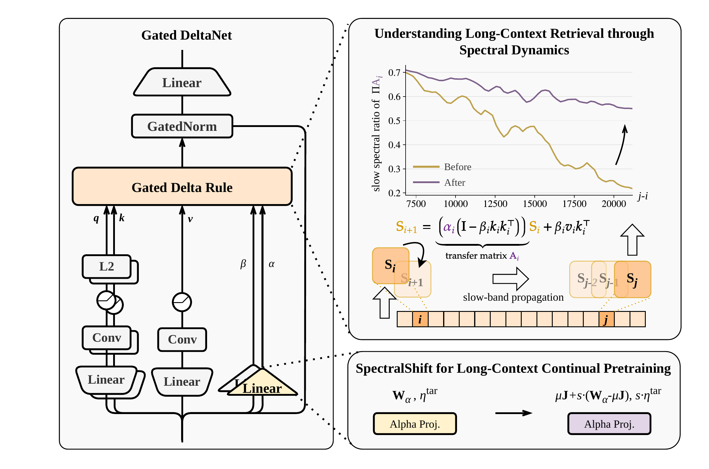

# SpectralShift

**Effective Context Window Extension of Gated DeltaNet via Spectral Reparameterization**

[](https://github.com/NVIDIA/Megatron-LM)
[](NOTICE)

[Main results](#main-results) · [Patch](patches/megatron-spectralshift.patch) · [代码逻辑梳理（中文）](docs/code_logic.md) · [Base manifest](docs/base_manifest.json)

SpectralShift adapts Gated DeltaNet (GDN) to longer contexts by reparameterizing its alpha projection once before continued pretraining, then scaling that projection's learning rate during training.

<p align="center">
  <a href="assets/SpectralShift_main.pdf">
    
  </a>
</p>

**Overview of SpectralShift.** Alpha-projection reparameterization and learning-rate scaling reshape GDN's decay spectrum to support long-context retrieval. [Download the vector figure (PDF)](assets/SpectralShift_main.pdf).

This repository releases the method as **one focused Megatron-LM patch**. It contains the weight transformation, split input projections, fused forward/backward, per-projection optimizer learning-rate multipliers, and the checkpoint/DDP plumbing needed by those changes. The patch is extracted and adapted from the original training implementation.

## Method

For reference length $L_{\mathrm{ref}}$ and target length $L_{\mathrm{tar}}$, the paper's Algorithm 1 uses

$$
s=\sqrt{L_{\mathrm{ref}}/L_{\mathrm{tar}}},\qquad
\mu_\alpha=\text{Mean}(W_\alpha),
$$

$$
W_\alpha\leftarrow\mu_\alpha J+s(W_\alpha-\mu_\alpha J),\qquad
\eta_\alpha(t)=s\,\eta_{\mathrm{base}}(t).
$$

$J$ is an all-ones matrix. The mean is taken over **each layer's complete alpha projection matrix**. The weight transformation runs once after loading the reference checkpoint. The optimizer LR ratio remains active throughout target-length training.

GDN parameterizes retention as

$$
\alpha_t=\exp\left[-\exp(A_{\log})\,\text{softplus}(W_\alpha h_t+b_{\mathrm{dt}})\right].
$$

Centering and scaling $W_\alpha$ changes input-dependent forgetting. Retention can increase or decrease according to the sign of the centered projection; the method reshapes the slow/fast spectral structure rather than uniformly increasing every gate. Applying SpectralShift does not require an SVD.

The paper uses the matrix mean and scales alpha's LR. Row centering and independent q/k/v/beta LR multipliers are additional options retained from the implementation.

## Main results

Table 3 of the paper reports general and retrieval evaluation for a **1.5B-A0.6B GDN-MoE** model. Continued pretraining starts from an 8K-context base model trained on 500B tokens, and extends the context to 32K, 64K or 128K. The staged **10B + 10B** curriculum first extends to 32K and then to the target context; **20B** denotes direct extension to the target context with the same total token budget.

<table>
  <thead>
    <tr>
      <th rowspan="2">Max. context</th>
      <th rowspan="2">CPT tokens</th>
      <th rowspan="2">Method</th>
      <th rowspan="2">General avg.</th>
      <th rowspan="2">DROP</th>
      <th rowspan="2">RACE</th>
      <th colspan="5">RULER</th>
    </tr>
    <tr><th>8K</th><th>16K</th><th>32K</th><th>64K</th><th>128K</th></tr>
  </thead>
  <tbody>
    <tr>
      <td rowspan="1">8K</td><td rowspan="1">—</td><td>Base Model</td><td>53.9</td><td>22.5</td><td>33.9</td><td>45.8</td><td>—</td><td>—</td><td>—</td><td>—</td>
    </tr>
    <tr>
      <td rowspan="2">32K</td><td rowspan="2">10B</td><td>SpectralShift</td><td>53.1</td><td>21.5</td><td><strong>34.2</strong></td><td><strong>57.1</strong></td><td><strong>52.9</strong></td><td><strong>45.8</strong></td><td>—</td><td>—</td>
    </tr>
    <tr>
      <td>Baseline</td><td><strong>53.5</strong></td><td><strong>22.3</strong></td><td>33.8</td><td>55.5</td><td>49.7</td><td>40.6</td><td>—</td><td>—</td>
    </tr>
    <tr>
      <td rowspan="4">64K</td><td rowspan="2">10B + 10B</td><td>SpectralShift</td><td><strong>55.5</strong></td><td><ins>24.1</ins></td><td><strong>33.0</strong></td><td><ins>64.0</ins></td><td><ins>59.7</ins></td><td><ins>52.7</ins></td><td><ins>45.4</ins></td><td>—</td>
    </tr>
    <tr>
      <td>Baseline</td><td>55.0</td><td>21.6</td><td>31.3</td><td>61.1</td><td>56.5</td><td>47.0</td><td>41.6</td><td>—</td>
    </tr>
    <tr>
      <td rowspan="2">20B</td><td>SpectralShift</td><td><ins>54.3</ins></td><td><strong>24.3</strong></td><td><ins>32.4</ins></td><td><strong>64.6</strong></td><td>59.7</td><td><strong>54.3</strong></td><td><strong>48.4</strong></td><td>—</td>
    </tr>
    <tr>
      <td>Baseline</td><td>53.2</td><td>23.0</td><td>32.1</td><td>64.2</td><td><strong>60.5</strong></td><td>53.9</td><td>46.4</td><td>—</td>
    </tr>
    <tr>
      <td rowspan="4">128K</td><td rowspan="2">10B + 10B</td><td>SpectralShift</td><td><strong>54.5</strong></td><td><strong>23.3</strong></td><td><strong>33.4</strong></td><td><strong>64.6</strong></td><td><strong>60.1</strong></td><td><strong>56.7</strong></td><td><strong>49.9</strong></td><td><strong>44.6</strong></td>
    </tr>
    <tr>
      <td>Baseline</td><td>53.7</td><td>20.7</td><td>32.4</td><td>64.3</td><td>57.2</td><td>51.9</td><td>45.4</td><td>43.1</td>
    </tr>
    <tr>
      <td rowspan="2">20B</td><td>SpectralShift</td><td><ins>54.0</ins></td><td><ins>22.6</ins></td><td>31.7</td><td><ins>62.2</ins></td><td><ins>56.3</ins></td><td><ins>49.8</ins></td><td><ins>42.9</ins></td><td><ins>42.2</ins></td>
    </tr>
    <tr>
      <td>Baseline</td><td>52.9</td><td>15.6</td><td><ins>33.1</ins></td><td>58.1</td><td>52.2</td><td>46.1</td><td>42.0</td><td>41.9</td>
    </tr>
  </tbody>
</table>

**Table 3.** General and retrieval evaluation under different context-extension settings. **Bold** marks the highest score within each maximum-context group; <ins>underlining</ins> marks the highest score within a curriculum pair when it is not already bold. “—” denotes an unreported result. General avg. covers MMLU, LAMBADA, ARC-Easy, WinoGrande and PiQA. All values are transcribed from the paper.

- **32K extension:** RULER at 32K improves from **40.6 to 45.8** (+5.2 points).
- **Staged 64K extension:** RULER at 32K improves from **47.0 to 52.7** (+5.7 points), and at 64K from **41.6 to 45.4** (+3.8 points).
- **Staged 128K extension:** the mean over the five RULER evaluation lengths rises from **52.38 to 55.18** (+2.80 points; **+5.35%** relative), while General avg. rises from **53.7 to 54.5**.

## Patch contents

| Original option | Runtime logic |
| --- | --- |
| `gdn_alpha_weight_scale` | Apply `W = mean(W) + scale * (W - mean(W))` to `a_proj.weight` once after load, in FP32, then copy back to the original dtype. |
| `gdn_alpha_weight_scale_mode` | `matrix` preserves one mean per projection; `row` preserves one mean per output row. |
| `gdn_lr_mult_{q,k,v,alpha,beta}` | Assign numerical optimizer-group LR multipliers to the corresponding projection **weights**. |
| `gdn_split_in_proj` | Construct six independent q/k/v/z/beta/alpha projections sharing one normalized input. |
| `gdn_fused_split_forward` | Concatenate weights for one linear forward, reconstruct the concatenation during backward, and distribute gradients to the original parameters. |

The patch modifies seven Megatron files:

| File | Change |
| --- | --- |
| `megatron/core/ssm/gated_delta_net.py` | Split projection construction, centered scaling, fused autograd, delayed weight-gradient handling and checkpoint key remapping. |
| `megatron/core/models/gpt/linear_attention_module_specs.py` | Provide a plain projection and a shared input norm alongside the existing fused-LayerNorm projection. |
| `megatron/core/optimizer/__init__.py` | Accept float multipliers while preserving the existing boolean callback contract. |
| `megatron/core/distributed/distributed_data_parallel.py` | Gather parameters used through the functional fused boundary before their forward computation. |
| `megatron/training/gdn_spectralshift.py` | Focused LR callback, post-load transformation, resume guard and runtime checks. |
| `megatron/training/training.py` | Connect the callback before optimizer construction and the transformation after checkpoint loading. |
| `megatron/training/checkpointing.py` | Save and restore the one-shot transformation marker. |

The baseline LR scheduler already applies `group['lr'] = new_lr * group.get('lr_mult', 1.0)`, so it needs no additional change.

## Megatron baseline

The patch targets the following exact Megatron source snapshot:

**[`c7590d8c3733619efa87a1a0733ac4cceedc683a`](https://github.com/NVIDIA/Megatron-LM/commit/c7590d8c3733619efa87a1a0733ac4cceedc683a)** — `ADLR/megatron-lm!4070 - [DEV] Support Qwen3next`, which adds `megatron/core/ssm/gated_delta_net.py` as a single file.

This snapshot is publicly retrievable through GitHub's NVIDIA/Megatron-LM commit endpoint. However, the [ancestry comparison with upstream `main`](https://github.com/NVIDIA/Megatron-LM/compare/c7590d8c3733619efa87a1a0733ac4cceedc683a...main) returned `diverged` during verification: this SHA is not an ancestor of the upstream `main` checked in that audit. Public availability alone does not establish membership in upstream `main` or an official release. Compatibility checks in this repository apply to this exact snapshot; see the provenance details in the [base manifest](docs/base_manifest.json).

Apply the patch from a clean checkout of that revision. From the Megatron repository root, with this repository available as the sibling directory `../GDN-SpectralShift`:

```bash
git apply --check ../GDN-SpectralShift/patches/megatron-spectralshift.patch
git apply ../GDN-SpectralShift/patches/megatron-spectralshift.patch
```

To check or reverse the patch on an otherwise unchanged checkout:

```bash
git apply -R --check ../GDN-SpectralShift/patches/megatron-spectralshift.patch
git apply -R ../GDN-SpectralShift/patches/megatron-spectralshift.patch
```

Newer Megatron revisions have reorganized GDN into a package. On those versions, port the corresponding changes using the [code walkthrough](docs/code_logic.md); this patch does not claim to apply unchanged to the latest branch.

## Integration contract

This release covers **runtime code**. It intentionally omits CLI argument registration, experiment presets and launch scripts. Your training entrypoint must expose the existing names to the objects the runtime reads:

- `GatedDeltaNet.config`: `gdn_split_in_proj` and `gdn_fused_split_forward` before model construction.
- Training `args`: `gdn_alpha_weight_scale`, `gdn_alpha_weight_scale_mode` and the five `gdn_lr_mult_*` values before optimizer setup.
- Checkpoint common state: `gdn_len_ext_postinit_applied`, saved and restored by the patch.

Without that plumbing, the runtime uses identity/default behavior. The patch does not automatically derive scaling values from sequence lengths.

The transformation changes only `a_proj.weight`. It does not transform `A_log`, `dt_bias` or projection biases, nor does it automatically freeze them. A non-unit GDN LR multiplier overrides an existing LR callback; a unit multiplier falls back to it. The z projection and other parameters receive no GDN-specific override. The original suffix-matching behavior is retained, so check for identically named projections outside GDN in your model.

Resume uses the checkpoint marker, plus the source implementation's fallback detection for loading from the same checkpoint output namespace. **Do not apply the transformation twice in the same extension stage.** For a deliberate new extension stage, clear the prior-stage marker as part of checkpoint preparation and use a separate output namespace. After transformation, `optimizer.reload_model_params()` synchronizes normal mixed-precision master weights; optimizer moments are preserved.

## Scope and validation

The patch targets TP=1 GDN with MCore DDP and the baseline's GDN execution path. The checkpoint norm remapping follows the source's RMSNorm-style weight-only layout. Fused parameter-gather overlap requires gradient-reduce overlap, a single distributed optimizer instance and `delay_wgrad_compute=False`. FP8, FSDP and precision-aware optimizer master-weight reload are excluded by runtime checks. The fused linear expects matching input/weight/gradient dtypes and does not add an autocast adapter.

This patch does not add context-parallel or packed-sequence support to the older Megatron baseline. Those facilities, newer architecture changes and the original training dispatcher are outside the method release. Inference support is inherited from the chosen baseline.

Validation performed on the extracted patch:

- Clean-base `git apply --check`, actual application, reverse application check, and exact comparison with the intended patched files.
- Python syntax checks for all seven patched files.
- 51 local CPU checks on the patched code, covering scaling/dtypes, source-method parity, fused forward/backward and saved tensors, `main_grad` hooks, LR callback semantics, post-load/resume behavior and the DDP gather boundary with fixtures.

These are local correctness and integration-contract checks. Full Megatron GPU training, distributed checkpoint round trips and the paper's benchmark results have not been reproduced by this release. Verification harnesses are kept outside the release; the repository contains no runnable training example or standalone package.

## Citation

The implementation follows the manuscript *SpectralShift: Effective Context Window Extension of Gated DeltaNet via Spectral Reparameterization*.

```bibtex
@misc{spectralshift2026,
  title = {SpectralShift: Effective Context Window Extension of Gated DeltaNet
           via Spectral Reparameterization},
  author = {Liu, Zian and Hu, Yiwen and Dong, Zican and Xie, Tian and
            Zhao, Wayne Xin and Ding, Yucheng and Tao, Ran and Dai, Bryan},
  year = {2026},
  note = {Manuscript}
}
```

No public paper identifier or publication venue is asserted here. The manuscript PDF, model checkpoints and training data are not bundled.

## License and acknowledgments

The GDN-derived changes retain Apache-2.0 attribution. The Megatron optimizer, training and DDP changes retain BSD-3-Clause attribution. New documentation uses BSD-3-Clause. See [NOTICE](NOTICE), [LICENSE](LICENSE) and [LICENSES](LICENSES) for details.

The original GDN source credits NVIDIA, Songlin Yang, Jan Kautz, Ali Hatamizadeh and code adopted from Hugging Face Transformers. This release preserves the relevant runtime code without including the original training repository or its history.
